 

<h3>Electrical Engineering @ IIT Gandhinagar</h3>

Hardware • VLSI • FPGA • Analog/Mixed-Signal • Neuromorphic Computing

---

## About

I'm an Electrical Engineering undergraduate at **IIT Gandhinagar** interested
in building hardware across the stack — from **semiconductor devices and
analog circuits to RTL, FPGA architectures, and hardware accelerators**.

My current work revolves around **FPGA-based digital systems, oscillator-based
computing, neuromorphic hardware, semiconductor devices, and circuit-level
modeling**.

I enjoy understanding how a system works at the lowest level and then turning
that understanding into something I can **simulate, implement, prototype, and test**.

---

## Focus areas

| | |
|---|---|
| ⚡ **Digital Hardware** | RTL Design • Verilog • FPGA • RISC-V • Digital Systems |
| 🧠 **Neuromorphic Computing** | Oscillatory Neural Networks • Ising Machines • Coupled Oscillators |
| 🔬 **Analog / Mixed-Signal** | MOSFETs • Device Characterization • Circuit Design • ADC/DAC |
| 🧩 **Device Modeling** | Verilog-A • VO₂ Devices • Compact Behavioral Models |
| 🔧 **Hardware Prototyping** | PCB Design • KiCad • Arduino • ESP32 • Hardware Debugging |

---

## Technologies & tools

### 💻 Languages

### ⚙️ EDA / Engineering

### Libraries

### 🔌 Hardware / Interfaces

### 🛠️ Development

---
## ⭐ featured repositories

 

  

---

## github activity

---

## connect

 

**Build → Simulate → Prototype → Debug → Understand ⚡**

